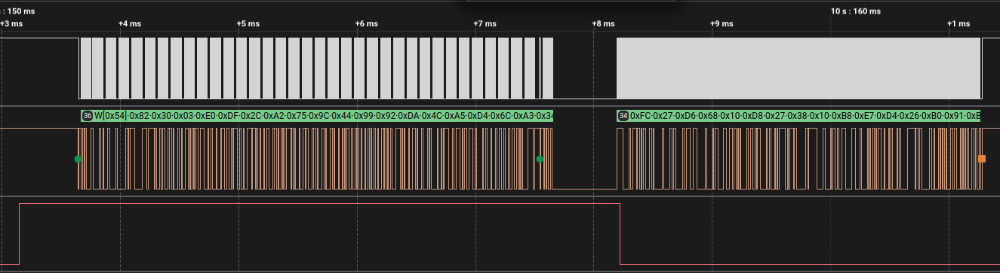
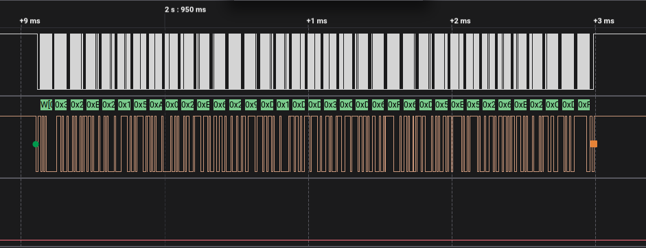
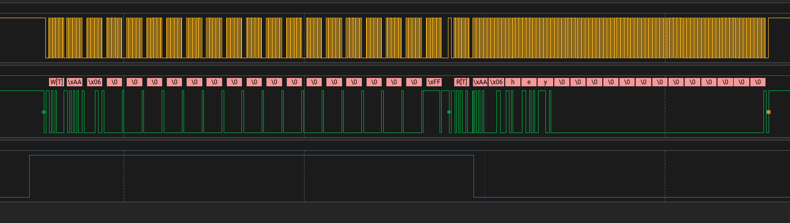
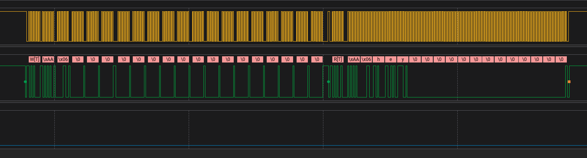
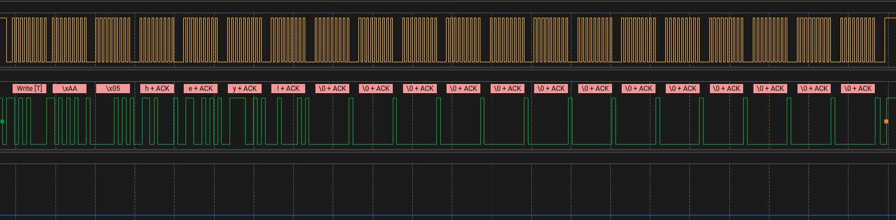

# BLE Serial -> I2C Bridge
Based on nRF Connect SDK Version 2.9

This sample provides an (optionally) encrypted I2C connection to an nRF54L15 acting as I2C peripheral. This I2C peripheral simultaneously acts as an authenticated and encrypted BLE peripheral that will only accept writes or send notifications to a properly authenticated BLE central.

Authentication and encryption uses AES-CTR with a randomized 16 byte nonce. Care should be taken to never repeat a nonce. Although using a random nonce provides reasonable security, a more robust option may be to use a monotonically increasing counter.

Note that the I2C peripheral and BLE peripheral functions of the nRF54L15 share a pre-shared key (PSK). This PSK would, ideally, be different between the I2C central and the BLE central. Also note that these examples operate without TF-M or use of secure key storage which **must** be implemented for proper device security.

---

## Build Instructions

For the i2c_peripheral:
```
cd i2c_peripheral
west build -b nrf54l15dk/nrf54l15/cpuapp -p auto
west flash
```

### Expected size of binary:

```
Memory region         Used Size  Region Size  %age Used
           FLASH:      210852 B      1420 KB     14.50%
             RAM:       68256 B       188 KB     35.46%
        IDT_LIST:          0 GB        32 KB      0.00%
```

For the i2c_central:
```
cd i2c_central
west build -b nrf54l15dk/nrf54l15/cpuapp -p auto
west flash
```

---

## Hardware Connections
| Function          | Peripheral | Central |
|-------------------|------------|---------|
| SCL               | P1.12      | P1.12   |
| SDA               | P1.14      | P1.14   |
| INT               | P1.10      | P1.10   |

**It is critical that the VDDIO of the I2C central is the same as the VDDIO of the nRF54L15-DK**

**By default, the I2C central provides pull-ups**

**Also connect ground between both kits**

---

## I2C Central Use

To read from a register (where 0x06 is the RX register):

```
i2c_bridge encrypt_send 0x06
```
A packet with an empty body is interpreted as a read command.
The I2C central will automatically read the RX register whenever the "INT" pin is high.

To write to a register (where 0x05 is the TX register):

```
i2c_bridge encrypt_send 0x05 helloworld
```

To write to the transmit register (and thus transmit to a connected device):

```
i2c_bridge write_tx helloworld
```

To read from the receive register:

```
i2c_bridge read_rx 
```

---

## Desktop BLE App Setup
```
cd ble_app
python3 -m venv venv
source venv/bin/activate
pip install -r requirements.txt
python main.py
```

Authentication will proceed automatically with a supported device.
The app will be notified of any data transmission from the I2C central and can send data to the I2C central.

Example:
```
Available Bluetooth adapters:
0: hci0 [E8:48:B8:C8:20:00]
Scanning for devices...
Scan started.
Found Zephyr [E2:0D:89:F2:15:D8]
Scan complete.

Available devices:
0: Zephyr [E2:0D:89:F2:15:D8]
Connecting to: Zephyr [E2:0D:89:F2:15:D8]
Successfully connected.
Discovered services:
Service UUID: 00001801-0000-1000-8000-00805f9b34fb
  Characteristic UUID: 00002a05-0000-1000-8000-00805f9b34fb
  UUID type <class 'str'>
  Characteristic UUID: 00002b29-0000-1000-8000-00805f9b34fb
  UUID type <class 'str'>
  Characteristic UUID: 00002b2a-0000-1000-8000-00805f9b34fb
  UUID type <class 'str'>
Service UUID: 5914f300-2155-43e8-a446-10de62953d40
  Characteristic UUID: 5914f302-2155-43e8-a446-10de62953d40
  UUID type <class 'str'>
  Characteristic UUID: 5914f301-2155-43e8-a446-10de62953d40
  UUID type <class 'str'>
  Characteristic UUID: 5914f303-2155-43e8-a446-10de62953d40
  UUID type <class 'str'>
Authenticating device...
Authentication packet sent.
Subscribing to notifications...
Subscribed to notifications.

Device is ready for communication.
You can now send data to the RX characteristic.
Enter message to send (or 'q' to quit): hello world!
Message sent.
Enter message to send (or 'q' to quit): 
Decrypted: b'\xbbhellohey\x00\x00\x00\x00\x00\x00\x00\x00'

Received notification: hellohey
```

---

## I2C Command Set
| Command | Value | Purpose | Implemented |
|---------|-------|---------|-------------|
| I2C_REG_STATUS | 0x00 | Retrieves the current status of the device | ✅ |
| I2C_REG_DEV_ID | 0x01 | Retrieves the device identifier | ✅ |
| I2C_REG_INT_SRC | 0x02 | Manages interrupt sources | 🚧 |
| I2C_REG_TX_BUF | 0x03 | Accesses the transmit buffer | ✅ |
| I2C_REG_TX_NUM | 0x04 | Controls transmit buffer count | 🚧 |
| I2C_REG_RX_BUF | 0x05 | Accesses the receive buffer | ✅ |
| I2C_REG_RX_NUM | 0x06 | Controls receive buffer count | 🚧 |
| I2C_REG_BLE_ADVERTISING | 0x07 | Controls or retrieves advertising settings | 🚧 |
| I2C_REG_BLE_CONN_PARAM | 0x08 | Sets or retrieves connection parameters | 🚧 |
| I2C_REG_BLE_POWER | 0x09 | Controls or retrieves power settings | 🚧 |

---

## Packet Formats
Packet formats for the I2C and BLE transports are defined in "common/inc/\[TRANSPORT\]_packet.h" files and are as follows:

I2C Plaintext Packet (i2c_reg_packet):
| Field | Type | Description |
|-------|------|-------------|
| `magic` | `uint8_t` | A byte likely used as a marker or identifier for the packet. |
| `reg` | `uint8_t` | A byte probably representing a register address or identifier. |
| `plaintext` | `uint8_t[DATA_SIZE_BYTES]` | An array of bytes containing the unencrypted data. The size is determined by the `DATA_SIZE_BYTES` constant. |
| `data` | `uint8_t[I2C_REG_PACKET_BYTES]` | A union member that overlaps with `magic`, `reg`, and `plaintext`, representing the entire packet data as a single byte array. The size is determined by the `I2C_REG_PACKET_BYTES` constant. |
| `read` | `bool` | A boolean flag, indicating whether this packet is for a read operation. |

I2C Encrypted Packet (i2c_reg_enc_packet):
| Field | Type | Description |
|-------|------|-------------|
| `ciphertext` | `uint8_t[I2C_REG_PACKET_BYTES]` | An array of bytes containing the encrypted data. The size is determined by the `I2C_REG_PACKET_BYTES` constant. |
| `nonce` | `uint8_t[NONCE_SIZE_BYTES]` | An array of bytes representing the nonce (number used once) for encryption. The size is determined by the `NONCE_SIZE_BYTES` constant. |
| `data` | `uint8_t[I2C_PACKET_SIZE_BYTES]` | A union member that overlaps with `ciphertext` and `nonce`, representing the entire packet data as a single byte array. The size is determined by the `I2C_PACKET_SIZE_BYTES` constant. |

BLE Plaintext Packet (ble_packet):
| Field | Type | Description |
|-------|------|-------------|
| `magic` | `uint8_t` | A byte likely used as a marker or identifier for the packet. |
| `plaintext` | `uint8_t[DATA_SIZE_BYTES]` | An array of bytes containing the unencrypted data. The size is determined by the `DATA_SIZE_BYTES` constant. |
| `data` | `uint8_t[BLE_PACKET_BYTES]` | A union member that overlaps with `magic` and `plaintext`, representing the entire packet data as a single byte array. The size is determined by the `BLE_PACKET_BYTES` constant. |

BLE Encrypted Packet (ble_enc_packet):
| Field | Type | Description |
|-------|------|-------------|
| `ciphertext` | `uint8_t[BLE_PACKET_BYTES]` | An array of bytes containing the encrypted data. The size is determined by the `BLE_PACKET_BYTES` constant. |
| `nonce` | `uint8_t[NONCE_SIZE_BYTES]` | An array of bytes representing the nonce (number used once) for encryption. The size is determined by the `NONCE_SIZE_BYTES` constant. |
| `data` | `uint8_t[BLE_PACKET_SIZE_BYTES]` | A union member that overlaps with `ciphertext` and `nonce`, representing the entire packet data as a single byte array. The size is determined by the `BLE_PACKET_SIZE_BYTES` constant. |

**Note: the formats may differ depending on which encryption method is used or which transports are encrypted.**

--- 

## BLE Characteristics
| Name | UUID | Purpose |
|------------|------|---------|
| BT_UUID_I2C_BRIDGE_SRV_VAL | 5914f300-2155-43e8-a446-10de62953d40 | Defines the UUID for the I2C Bridge Service |
| BT_UUID_I2C_BRIDGE_RX_CHAR_VAL | 5914f301-2155-43e8-a446-10de62953d40 | Defines the UUID for the I2C Bridge Receive Characteristic |
| BT_UUID_I2C_BRIDGE_TX_CHAR_VAL | 5914f302-2155-43e8-a446-10de62953d40 | Defines the UUID for the I2C Bridge Transmit Characteristic |
| BT_UUID_I2C_BRIDGE_AUTH_CHAR_VAL | 5914f303-2155-43e8-a446-10de62953d40 | Defines the UUID for the I2C Bridge Authentication Characteristic |

---

## Theory of operation
BLE central devices support a wide variety of authentication methods for connected devices. These include "Just Works" pairing that requires no input from the user through a keypad or display. Unfortunately, if a peripheral device has no means for input or output of data, it is impossible to authenticate a BLE connection without additional handling at the application layer.

To accomplish this, a pre-shared key (AES-128) is given to the BLE peripheral and BLE central. All communication across the BLE or I2C link will be encrypted with this key using [AES-CTR](https://en.wikipedia.org/wiki/Block_cipher_mode_of_operation#Counter_(CTR)) with a 128-bit nonce.
The central device connects to the peripheral. On the peripheral, an "authentication timer" is started. If the central device does not send a proper authentication packet to the authentication characteristic, the peripheral automatically disconnects from the central.
After authentication the central subscribes to notifications from the peripheral and is able to send encrypted packets to the peripheral.

On the I2C side of the link, communications are similarly encrypted. The I2C peripheral uses a separate interrupt line to notify the I2C central of newly available data and automatically sends any data over BLE to the connected central as it becomes available.

The I2C peripheral implements a number of 16-byte wide registers. When a command is written from the I2C central, the register value's associated read or write function is called in "i2c_periphral/src/i2c_registers.c"

---

## Example I2C Transactions

Receive:
<p align="center">
  
</p>

Transmit:
<p align="center">
  
</p>

## Example **UNENCRYPTED** I2C Transatcion
### **Do not use unencrypted I2C in production**

I2C Read (from INT pin BLE write):
<p align="center">
  
</p>

I2C Read (asynchronous):
<p align="center">
  
</p>

I2C Write (for BLE transmission):
<p align="center">
  
</p>

